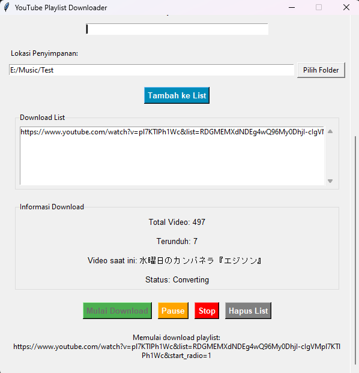

# YouTube Playlist Downloader

  
  
  
  
  
  
  *Aplikasi download playlist YouTube dengan antarmuka yang mudah digunakan, mendukung format MP3 dan MP4.*

## Fitur

### Fitur Utama
- Download playlist YouTube
- Pilihan format MP3 dan MP4
- Kualitas audio hingga 320kbps
- Kualitas video hingga 1080p
- Multi-playlist download
- Pause dan Resume download
- Antrian download

### Fitur Tambahan
- Antarmuka yang user-friendly
- Progress download real-time
- Status download yang detail
- Pilihan folder penyimpanan
- Portable (tidak perlu instalasi)

## Cara Penggunaan

1. **Download Playlist**
   - Paste URL playlist YouTube
   - Pilih format (MP3/MP4)
   - Pilih kualitas
   - Pilih folder tujuan
   - Klik "Tambah ke List"
   - Klik "Mulai Download"

   

   
Lihat Screenshot

   
   

2. **Kontrol Download**
   - Pause/Resume download
   - Stop download
   - Hapus list
   - Lihat progress

   

   
Lihat Screenshot

   
   

## Download

Dapatkan versi terbaru:

## Kegunaan

- Download playlist musik
- Backup playlist YouTube
- Convert playlist ke MP3
- Download video course
- Offline viewing

## Keunggulan

- **Mudah Digunakan**: Interface yang simpel dan intuitif
- **Portable**: Tidak perlu instalasi
- **Efisien**: Download dan konversi otomatis
- **Fleksibel**: Mendukung berbagai format dan kualitas
- **Handal**: Bisa pause dan resume download

## Kontribusi

Jika Anda menemukan bug atau punya saran:
- Star repository ini
- Laporkan issues
- Usulkan fitur baru
- Submit pull request

## Dukung Pengembangan

  

## Lisensi

Proyek ini dilisensikan di bawah Lisensi MIT - lihat file [LICENSE](LICENSE) untuk detail.

---

  Dibuat dengan love oleh <a href="https://github.com/enowdev">Enow Antariksa</a>

